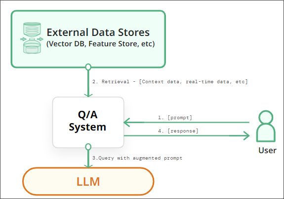
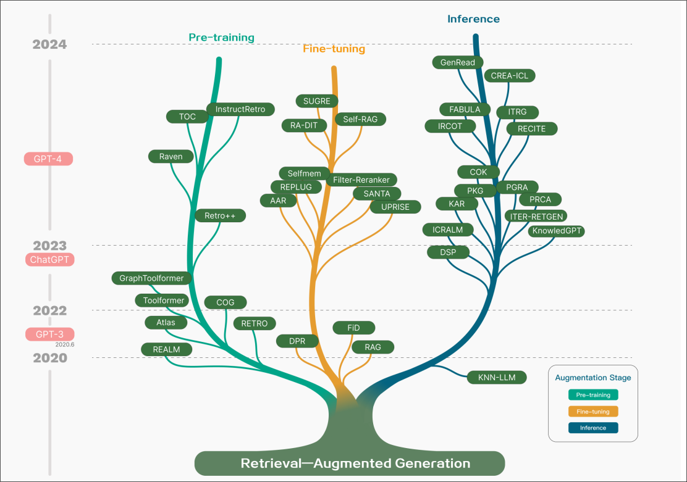
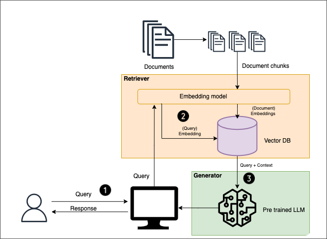

# Retrieval Augmented Generation (RAG)

<!--  -->

## What is RAG?

RAG is a technique that enhances the capabilities of large language models (LLMs) by retrieving relevant information from external knowledge sources at runtime. This allows the chatbot to generate more accurate, reliable, and up-to-date responses, even for tasks requiring specific domain knowledge. In other words RAG can be defined as an AI framework for retrieving facts from an external knowledge base to ground large language models (LLMs) on the most accurate, up-to-date information and to give users insight into LLMs' generative process.

<!--  -->

    
    
Figure: The evolutionary trajectory of RAG unfolds across four distinctive phases, as illustrated. In its inception in 2017, aligned with the emergence of the Transformer architecture, the primary thrust was on assimilating additional knowledge through Pre-Training Models (PTM) to augment language models. This epoch witnessed RAG’s foundational efforts predominantly directed at optimizing pre-training methodologies

## RAG Architecture

Setting up a RAG system involves fine-tuning two main components: the retriever and the generator. These work concurrently to identify relevant documents for a query and to craft precise answers.

**Document Database Preparation**: Initially, a vector database is established to house articles. Long articles are divided into manageable sections because language models have processing limits. These sections are converted into vectors, or numerical representations, and stored for fast retrieval.

    

**Generalized representation of a simple RAG system.**

- Step 1: It starts with a user submitting a query or a prompt, which is the input for the system.
- Step 2: The query is then transformed into a numerical vector using an embedding model. This vector is a condensed numerical representation of the query.
- Step 3: Using this vector, the system accesses a vector database—a type of database optimized for high-speed vector calculations and retrieval—to run a retrieval algorithm. The vector database quickly scans through extensive datasets to locate documents or text snippets that match the query's vector.
- Step 4: The documents or snippets identified by the retrieval algorithm are those most relevant to the query, containing information that potentially answers the user's question.
- Step 5: These retrieved documents are encoded into vectors using the same embedding model. The result is a collection of vectors that capture the context of the retrieved information.
- Step 6: The system combines the vectors of the original query and the retrieved documents.
- Step 7: With the context established, a foundation model, such as GPT-3 or GPT-4, synthesizes a coherent and contextually informed response to the query.
- Step 8: Finally, the system delivers the generated answer to the user. The goal is to provide a response that is as accurate and relevant as possible. Source: Author

### Query Processing

A user's question is transformed into a vector, enabling the RAG system to grasp the meaning and search for corresponding content in the document database.

### Relevant Information Retrieval

The retriever searches the database with the query's vector to find closely related document sections. This is achieved by calculating similarity based on the "distance" between the question vector and the vectors of documents in the database.

### Answer Generation

The generator receives the query alongside the most relevant sections from the documents. Leveraging this information, it generates a coherent and contextually appropriate response. Effective prompt engineering is essential to guide the language model toward more accurate outcomes.
