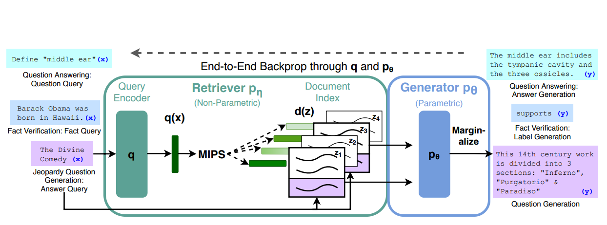

# How does RAG work?

Retrieval-Augmented Generation (RAG) is an approach that enhances natural language processing tasks.

It does so by combining two distinct models: a **retriever** and a **generator**.

The 2021 paper by Lewis et al., titled "[Retrieval-Augmented Generation for Knowledge-Intensive NLP Tasks](https://arxiv.org/pdf/2005.11401.pdf)," popularized this concept.

It built on an earlier paper by Guu et al., which introduced the concept of integrating knowledge retrieval during a model's pre-training stage.

[Source: Retrieval-Augmented Generation for Knowledge-Intensive NLP Tasks](https://arxiv.org/pdf/2005.11401.pdf)

Let's break down how these two models work together:

## Retriever vs Generator

### The Retriever Model

This part of RAG is designed to pinpoint relevant information within a vast dataset. Using advanced techniques known as dense retrieval, the retriever creates numerical representations—called embeddings—of both queries and documents. It places similar queries and documents near each other in a high-dimensional space.

When a query comes in, the model uses semantic search methods, like cosine similarity, to identify and deliver the most contextually fitting documents. The strength of this model lies in its precision; it excels at quickly finding the exact information required from a large pool of data.

For illustration, consider an image that shows the word embeddings for terms like "king," "queen," "man," and "woman" in a three-dimensional space, demonstrating how semantically related terms cluster together.

### The Generator Model

After the retriever finds the relevant data, the generator takes over. This component crafts coherent and contextually aligned responses. Built typically on transformer architectures, the generator uses the provided context to create responses that are not only grammatically correct but also factually accurate.

The generator's forte is in generating completely new content, which is particularly useful for creative tasks or in developing conversational agents like chatbots.

The retriever model serves as the RAG system's semantic search engine, sourcing documents that semantically align with the query.

This synergy between the retriever and generator makes RAG particularly powerful for producing quality responses informed by large amounts of data.

Now, before we move on to explaining the RAG architecture, let’s also have a quick look at the semantic search.

## Semantic Search

When managing a website or e-commerce site with a vast array of content or products, standard keyword searches may fall short.

They rely on matching specific words in a query, often leading to results that miss the context or intent behind the search. Semantic search improves upon this by grasping the query's meaning, fetching content that is relevant in meaning, not just in word match.

Take this scenario:

You type "Entry-level positions in the renewable energy sector" into a search bar. A basic keyword search might display pages containing "entry-level," "positions," "renewable," "energy," and "sector." But this doesn't mean you'll find job listings.

Instead, you might see educational articles or industry news.

With semantic search, however, the system understands you're seeking job openings in the renewable energy field at an entry-level.

It then presents specific job listings such as "Junior Solar Panel Installer" or "Wind Turbine Technician Trainee," directly answering your search intent. Semantic search connects the dots between words and meanings, providing you with results that matter.

## Cosine Similarity

Cosine similarity is a metric that evaluates how similar two documents are, regardless of their size.

This method calculates the cosine of the angle between two non-zero vectors in a multi-dimensional space—these vectors represent the text content.

It's a tool that proves highly effective in semantic searches, which focus on finding material that shares meaning with the query, not just identical keywords.

